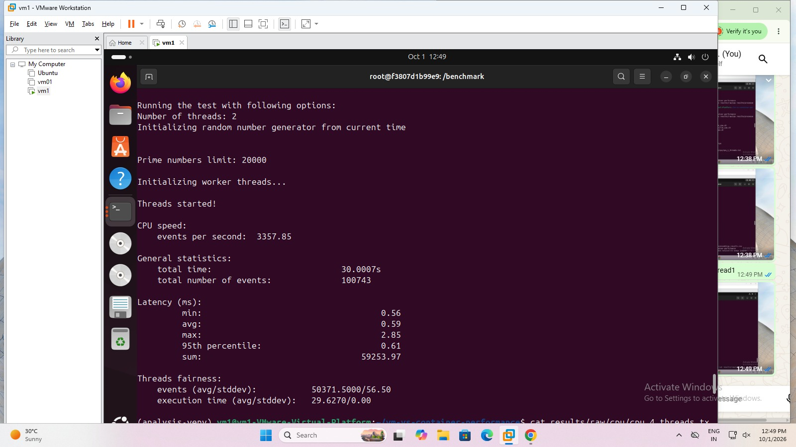
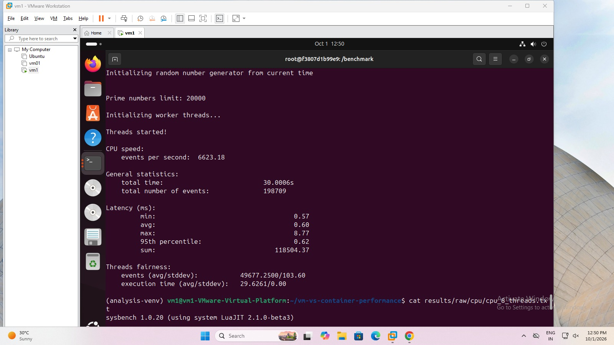
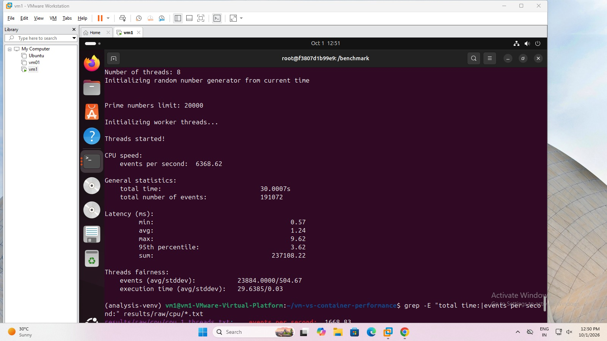

# Performance Analysis of Virtual Machines and Containers

## 1. Introduction

This experiment focuses on the performance analysis of virtual machines and containers.

The experiment uses:

* **VMware** as the virtualization platform
* **Docker** as the containerization platform
* **Ubuntu 24.04.5 LTS** as the operating system
* **Sysbench** for CPU and memory performance benchmarking
* **fio** for disk I/O benchmarking
* **iperf3** for network performance benchmarking
* **FastAPI** for application performance testing

Both environments are configured with comparable system resources so that their CPU, memory, disk, network and application performance can be compared.

---

## 2. Objectives

The objectives of this experiment are:

1. To configure and verify a virtual machine environment.
2. To create and configure a Docker container environment.
3. To verify CPU, memory and disk configurations.
4. To perform CPU and memory benchmarking using Sysbench.
5. To measure disk I/O performance using fio.
6. To measure network performance using iperf3.
7. To evaluate FastAPI application performance.
8. To record the benchmark results.
9. To compare the performance of virtual machines and containers.

---

## 3. Experimental Configuration

| Resource          | Configuration      |
| ----------------- | ------------------ |
| Operating System  | Ubuntu 24.04.5 LTS |
| CPU               | 4 vCPU             |
| Memory            | 7.761 GiB          |
| Disk              | 60 GB              |
| Container Runtime | Docker             |
| CPU Benchmark     | Sysbench 1.0.20    |
| Memory Benchmark  | Sysbench 1.0.20    |
| Disk Benchmark    | fio 3.36           |
| Network Benchmark | iperf3 3.16        |
| Application       | FastAPI            |
| API Benchmark     | ApacheBench / wrk  |

---

# 4. Part A - Virtual Machine

## 4.1 VMware Virtual Machine

VMware is used to provide the virtual machine environment for the first part of the experiment.

The virtual machine is configured with the following resources:

| Parameter               | Configuration      |
| ----------------------- | ------------------ |
| Virtualization Platform | VMware             |
| Guest OS                | Ubuntu 24.04.5 LTS |
| CPU                     | 4 vCPU             |
| Memory                  | 7.761 GiB          |
| Disk                    | 60 GB              |
| Available Disk Space    | 45 GB              |

## 4.2 Ubuntu Verification

The CPU configuration is checked using:

```bash
nproc
```

This command is used to check the number of available CPU processing units.

Memory information is checked using:

```bash
free -h
```

This command is used to check the total, used, free and available memory.

Disk information is checked using:

```bash
lsblk
```

This command is used to identify the available storage devices and their partitions.

The available disk space is checked using:

```bash
df -h
```

This command is used to check the disk space available on the mounted file systems.

---

## 4.3 Benchmark Tools Verification

The benchmark tools are verified using:

```bash
sysbench --version
```

```bash
fio --version
```

```bash
iperf3 --version
```

These commands are used to verify that Sysbench, fio and iperf3 are installed and available for the experiments.

---

## 4.4 CPU Benchmark

The CPU benchmark is executed using different numbers of threads.

The 1-thread benchmark is executed using:

```bash
sysbench cpu --cpu-max-prime=20000 --threads=1 --time=30 run
```

The 2-thread benchmark is executed using:

```bash
sysbench cpu --cpu-max-prime=20000 --threads=2 --time=30 run
```

The 4-thread benchmark is executed using:

```bash
sysbench cpu --cpu-max-prime=20000 --threads=4 --time=30 run
```

The 8-thread benchmark is executed using:

```bash
sysbench cpu --cpu-max-prime=20000 --threads=8 --time=30 run
```

These commands are used to measure CPU performance at different levels of parallelism.

## 4.5 Memory Benchmark

The memory benchmark is executed using:

```bash
sysbench memory --memory-block-size=1M --memory-total-size=10G --threads=4 run
```

This command is used to measure the memory write throughput of the virtual machine.

### Type of Operation

* Block size: 1 MiB
* Total size: 10 GiB
* Threads: 4
* Operation: Write

## 4.6 Disk I/O Benchmark

The disk benchmark is executed using:

```bash
fio --name=vm-disk --filename=/tmp/testfile --size=10G --bs=1M --rw=write --direct=1 --iodepth=16 --runtime=30 --time_based --group_reporting
```

This command is used to measure sequential disk write performance using fio.

The test measures:

* IOPS
* Bandwidth
* Latency

## 4.7 Network Benchmark

The IP address of the virtual machine is checked using:

```bash
hostname -I
```

This command is used to identify the IP address required for the network performance test.

The iperf3 network benchmark is executed using:

```bash
iperf3 -c 192.168.234.130 -t 10
```

This command is used to measure network throughput between the VM and the iperf3 server for 10 seconds.

## 4.8 VM Results

### CPU Results

| Threads | VM Events/sec |
| ------: | ------------: |
|       1 |       1668.83 |
|       2 |       3357.85 |
|       4 |       6623.18 |
|       8 |       6368.62 |

### Memory Result

| Metric            |                VM |
| ----------------- | ----------------: |
| Memory Throughput | 105162.73 MiB/sec |

### Disk Result

| Metric    |           VM |
| --------- | -----------: |
| IOPS      |         1771 |
| Bandwidth | 1771 MiB/sec |

### Network Result

| Metric    |             VM |
| --------- | -------------: |
| Transfer  |        75.8 GB |
| Bandwidth | 65.1 Gbits/sec |

---

| VM Thread 1 | VM Thread 2 |
|---|---|
|  |  |

| VM Thread 4 | VM Thread 8 |
|---|---|
|  |  |


---

# 5. Part B - Docker Container

## 5.1 Docker Container

Docker is used as the containerization platform for the second part of the experiment.

A benchmark container is created using the Docker image:

```bash
sudo docker run -it --name benchmark-container vn-vs-container
```

The container is used to execute the same benchmark tools and workloads used for the virtual machine.

| Parameter         | Configuration          |
| ----------------- | ---------------------- |
| Container Runtime | Docker                 |
| Base Image        | Ubuntu 24.04           |
| Container Image   | vn-vs-container:latest |
| CPU               | Host resources         |
| Memory            | Host resources         |
| Benchmark Tools   | Sysbench, fio, iperf3  |

## 5.2 Container Verification

The container is started using:

```bash
sudo docker start benchmark-container
```

The container is entered using:

```bash
sudo docker exec -it benchmark-container bash
```

These commands are used to start the benchmark container and access its terminal for executing the experiments.

The installed benchmark tools are checked using:

```bash
sysbench --version
```

```bash
fio --version
```

```bash
iperf3 --version
```

---

## 5.3 CPU Benchmark

The CPU benchmark is executed using:

```bash
sysbench cpu --cpu-max-prime=20000 --threads=1 --time=30 run
```

```bash
sysbench cpu --cpu-max-prime=20000 --threads=2 --time=30 run
```

```bash
sysbench cpu --cpu-max-prime=20000 --threads=4 --time=30 run
```

```bash
sysbench cpu --cpu-max-prime=20000 --threads=8 --time=30 run
```

These commands are used to measure container CPU performance at different thread levels.

## 5.4 Memory Benchmark

The memory benchmark is executed using:

```bash
sysbench memory --memory-block-size=1M --memory-total-size=10G --threads=4 run
```

This command is used to measure memory write throughput inside the container.

### Memory Result

| Metric            |         Container |
| ----------------- | ----------------: |
| Memory Throughput | 119741.15 MiB/sec |

## 5.5 Disk I/O Benchmark

The disk benchmark is executed using:

```bash
fio --name=container-disk --filename=/tmp/testfile --size=10G --bs=1M --rw=write --direct=1 --iodepth=16 --runtime=30 --time_based --group_reporting
```

This command is used to measure the sequential write performance of the container storage.

### Disk Result

| Metric    |    Container |
| --------- | -----------: |
| IOPS      |         1805 |
| Bandwidth | 1806 MiB/sec |

## 5.6 Network Benchmark

The container network benchmark is executed using:

```bash
iperf3 -c 192.168.234.130 -t 10
```

This command is used to measure the network throughput from inside the container.

### Network Result

| Metric    |      Container |
| --------- | -------------: |
| Transfer  |        70.1 GB |
| Bandwidth | 60.2 Gbits/sec |

---

## 5.7 Container Startup Time

Container startup time is measured using:

```bash
time docker run -d --name startup-test -p 8000:8000 performance-api
```

This command is used to measure the time required to launch a new Docker container.

After the test, the container is stopped and removed using:

```bash
docker stop startup-test
docker rm startup-test
```

These commands are used to remove the previous container before performing another clean startup measurement.

### Startup Results

| Run   | Startup Time |
| ----- | -----------: |
| Run 1 |     0.3585 s |
| Run 2 |     0.2875 s |
| Run 3 |     0.2855 s |

---

## 5.8 FastAPI Application

The FastAPI application is verified using:

```bash
curl http://localhost:8000/health
```

The command is used to check whether the API is running correctly.

The compute endpoint is checked using:

```bash
curl http://localhost:8000/compute
```

The command is used to verify the compute functionality of the application.

The memory endpoint is checked using:

```bash
curl http://localhost:8000/memory
```

The command is used to verify the memory-related API endpoint.

---

## 5.9 API Benchmark

The `/health` endpoint is benchmarked using ApacheBench:

```bash
ab -n 10000 -c 100 http://127.0.0.1:8000/health
```

This command is used to send 10,000 requests with 100 concurrent requests to the health endpoint.

### Health Endpoint Results

| Metric               |    Result |
| -------------------- | --------: |
| Complete Requests    |     10000 |
| Failed Requests      |         0 |
| Requests/sec         |   2654.45 |
| Time/request         | 37.673 ms |
| Maximum Request Time |     77 ms |

The `/compute` endpoint is benchmarked using:

```bash
ab -n 10000 -c 100 http://127.0.0.1:8000/compute
```

This command is used to measure the performance of the compute endpoint under concurrent requests.

### Compute Endpoint Results

| Metric               |     Result |
| -------------------- | ---------: |
| Complete Requests    |      10000 |
| Failed Requests      |          0 |
| Requests/sec         |     278.01 |
| Time/request         | 359.705 ms |
| Maximum Request Time |     498 ms |

---

## 5.10 API Scalability

The API scalability test is performed using `wrk`.

The first test is executed using:

```bash
wrk -t1 -c10 -d30s --latency http://127.0.0.1:8000/health
```

This command is used to test the API using 1 thread and 10 connections for 30 seconds.

The second test is executed using:

```bash
wrk -t2 -c50 -d30s --latency http://127.0.0.1:8000/health
```

This command increases the number of threads and connections to observe API performance under higher load.

The third test is executed using:

```bash
wrk -t4 -c100 -d30s --latency http://127.0.0.1:8000/health
```

The fourth test is executed using:

```bash
wrk -t4 -c200 -d30s --latency http://127.0.0.1:8000/health
```

These commands are used to analyze API scalability as the number of concurrent connections increases.

### API Scalability Results

| Threads | Connections | Requests/sec | Average Latency | P99 Latency | Total Requests |
| ------: | ----------: | -----------: | --------------: | ----------: | -------------: |
|       1 |          10 |      2042.20 |         4.87 ms |     9.36 ms |          61311 |
|       2 |          50 |      2168.60 |        23.01 ms |    35.65 ms |          65112 |
|       4 |         100 |      1997.40 |        49.95 ms |    69.16 ms |          60020 |
|       4 |         200 |      1952.42 |       102.09 ms |   125.54 ms |          58699 |

---

# 6. Performance Comparison

The benchmark results obtained from both environments are compared using the following parameters:

| Performance Metric |    Virtual Machine |   Docker Container |
| ------------------ | -----------------: | -----------------: |
| CPU - 1 Thread     | 1668.83 events/sec | 1666.88 events/sec |
| CPU - 2 Threads    | 3357.85 events/sec | 3367.80 events/sec |
| CPU - 4 Threads    | 6623.18 events/sec | 6674.13 events/sec |
| CPU - 8 Threads    | 6368.62 events/sec | 6614.98 events/sec |
| Memory             |  105162.73 MiB/sec |  119741.15 MiB/sec |
| Disk I/O           |       1771 MiB/sec |       1806 MiB/sec |
| Disk IOPS          |               1771 |               1805 |
| Network            |     65.1 Gbits/sec |     60.2 Gbits/sec |
| Startup Time       |                  — |    0.2855–0.3585 s |

The CPU benchmark shows that both environments provide similar CPU performance.

The container provides higher memory and disk throughput in the measured tests, while the VM provides higher network throughput.

The container also provides very fast startup time.

---

# 7. Conclusion

The performance results of the virtual machine and Docker container are compared using CPU, memory, disk I/O, network and application benchmarks.

Both environments provide similar CPU performance, with the container showing a small advantage at higher thread counts.

The container achieves higher memory throughput and slightly higher disk I/O performance in the measured tests.

The VM achieves higher network throughput than the container.

The Docker container also provides very fast startup time, with measured startup times below one second.

The FastAPI benchmarks show that the containerized application can handle a high number of requests, while latency increases as the concurrent load increases.

Overall, the experiment shows that containers provide performance close to virtual machines for CPU, memory and disk workloads while offering faster startup and efficient resource utilization.
